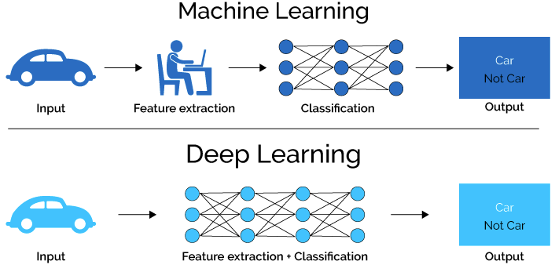

# Deep Learning

> **Deep Learning** is a sub field of machine learning concerned with algorithms inspired by the structure and function of the brain called **artificial neural networks.**

#### **Neural Network**&#x20;

ANN are computing systems inspired from biological neurons, their name and structure are inspired by the human brain, mimicking the way that biological neurons signal to one another. Artificial neural networks (ANNs) are composed of a node layer, containing an input layer, one or more hidden layers, and an output layer. Each node, or artificial neuron, connects to another and has an associated weight and threshold. If the output of any individual node is above the specified threshold value, that node is activated, sending data to the next layer of the network. Otherwise, no data is passed along to the next layer of the network.

<figure><figcaption></figcaption></figure>

There are two operations in every single neuron, first input and weights gets summed and then get passed through activation function f.

<figure><figcaption></figcaption></figure>

**Feed Forward Neural Network:**

Deep feedforward networks, also called feedforward neural networks, or multilayer perceptrons(MLPs), are the quintessential deep learning models. The goal of the feedforward network is to approximate some function f. For example, for a classifier, y = f(x) maps an input x to a category y. A feedforward network defines a mapping y = f (x; θ) and learns the value of parameters θ that result in the best function approximation. These models are called feedforward because information flows through the function being evaluated from x, through the intermediate computations used to define f, and finally to the output y.

.png>)

This is a two layer neural network, One is hidden layer (having 3 neurons) and one is output layer(having 2 neurons). Feedforward refers to a unidirectional flow of information (and no lateral/intra-layer connections) from input to output.&#x20;

Predicted output is compared to the actual output during the training process, and the difference (loss) determines how much the weights should be tweaked. Tweaking the gradients and thereby the weights is done through **backpropagation**

* Output Layer: Represents the output of neural network ( each node correspond to the class)&#x20;
* Hidden Layer: Represents the intermediary nodes. it takes set of weighted input and produces output an activation function.
* Input Layer: Represents the dimension of the input vector, one node for each dimension. (In above diagram 3 inputs are there i.e. 3 nodes in input layer)

While training a neural network, keep these points in mind:

* Decide the structure of network
* &#x20;Decide the structure of network
* Create a neural network
* Choose different hyper-parameters
* Calculate loss, Reduce loss
* Repeat last three steps

Training Deep Learning isn't walk in the park, following problems can you can run into while training a DNN

1. You may faced Vanishing gradients or exploding gradient&#x20;
2. Model with million parameters would be risky to overfit.
3. Training maybe extremely slow.
4. You might not have enough training data for large network.

**Error or Loss Function :**

In general, error/loss is the difference between actual vs predicted values. And the goal is to minimize the loss while training a neural network, and we can calculate the error using Loss function and there are different kind of loss function, one should choose based on problem at hand. Loss function are different for Regression and Classification.&#x20;


Check Loss Function section under Machine Learning for more in depth details. &#x20;


**Optimization**

In optimization, the main aim is to find the weights that reduce loss. Gradient is calculated by optimization function; it is the change in loss with change in weights. The weights are modified according to the calculated gradient and the same process keeps on repeating until the minima reaches.&#x20;

Gradient Descent is the method that defines the cost function of parameters and uses a systematic approach to optimize the values of parameters to get the minimum cost function. And we get only one local optimum solution after using gradient descent. Gradient descent has 3 different variations; these differ in using data to calculate the gradient of the objective function.&#x20;

1. Batch gradient descent - Updates the parameter by calculating gradients of the whole dataset.
2. Stochastic gradient descent – Updates the parameter by calculating gradients for each training example.
3. Mini-batch gradient descent – Updates the parameter by calculating gradients for every mini batch of “n” training examples. Combination of batch and stochastic gradient descent.&#x20;

**Backpropagation**&#x20;

Backpropagation is used while training a feed forward neural network, it helps in efficiently calculating the gradient of loss function w.r.t weights and that helps in minimizing the loss by updating weights.&#x20;

At the end of each forward pass, we have a loss(difference between actual and predicted outcome). The core of backprop is a partial derivatives of loss w.r.t weights which tells us how quickly the loss changes for any change in weights. Backprop follows the rule of chain rule of derivatives, i.e. the loss can be computed for each and every weight in the network.&#x20;

Learning rate (lr) is a hyper parameter which determines to what extent newly acquired weights overrides old weights. In general, it lies between 0 and 1. Momentum is used to decide the weight on nodes from previous iterations. It helps in improving training speed and also in avoiding local minima.

In backprop new weight gets updated: --  W\_new = W\_old – lr \* d (loss) / d(W\_old)

d – derivative, lr – leaning rate, W – weight&#x20;

Chain Rule : The derivative of sigmoid function is between 0 – 0.25. And as we go backward calculating derivative w.r.t weights it will be decreasing. Derivative of Tanh function is between 0 – 1

To understand math behind backprop follow these two videos:











**What if ?**

Initialize weights to 0, this makes your model equivalent to linear model and when you set weights to 0, the derivatives w.r.t to loss function is same for every w in every layer thus, all the weights have the same values in the subsequent iteration. This makes the hidden units symmetric and continues for all the n iterations you run. Thus setting weights to zero makes your network no better than a linear model.

Initializing weights randomly, while working with a (deep) network can potentially lead to 2 issues — vanishing gradients or exploding gradients.

**Vanishing / Exploding Gradients**&#x20;

As the backpropagation algorithm advances downwards(or backward) from the output layer towards the input layer, the gradients often get smaller and smaller and approach zero which eventually leaves the weights of the initial or lower layers nearly unchanged. As a result, the gradient descent never converges to the optimum. This is known as the **vanishing gradients** problem.

On the contrary, in some cases, the gradients keep on getting larger and larger as the backpropagation algorithm progresses. This, in turn, causes very large weight updates and causes the gradient descent to diverge. This is known as the **exploding gradients** problem.

Following are some signs that can indicate that our gradients are exploding/vanishing :

|                      **`Exploding`**                    |                                                             **`Vanishing`**                                                            |
| :-----------------------------------------------------: | :------------------------------------------------------------------------------------------------------------------------------------: |
| There is an exponential growth in the model parameters. | The parameters of the higher layers change significantly whereas the parameters of lower layers would not change much (or not at all). |
|    The model weights may become NaN during training.    |                                             The model weights may become 0 during training.                                            |
|        The model experiences avalanche learning.        |           The model learns very slowly and perhaps the training stagnates at a very early stage just after a few iterations.           |

By using following techniques we can fix these problems:-

* Proper weight initialization&#x20;
* Using Non-saturating Activation function such as ReLU, Leaky ReLU&#x20;
* Batch Normalization
* Gradient Clipping&#x20;


To learn about Batch Normalization and other regularization technique, follow Regularization section under deep Learning.&#x20;


Vanishing/ Exploding Gradients&#x20;

As we know in order to train a neural network we need to update the networks weights in such a manner as to minimize the loss function. The magnitude and direction of the updates is specified by the gradients calculated during backpropagation. As a result of this the amount each weight is updated is proportional to its associated gradient.

Now, as the weights are being updated in proportion to their associated gradients it is clear that if the gradients become very small the updates to the weights will be negligible. In the event that this occurs learning will be inhibited as the weights are not being updated as required. This problem of very small gradients is known as the vanishing gradient problem. The vanishing gradient problem particularly affects the lower layers of the network and makes them more difficult to train. W\_old = W\_new. When old weight is equal to new updated weight, then its vanishing problem.&#x20;

Similarly, if the gradient associated with a weight becomes extremely large the updates to the weight will also be large. This can cause the gradients to become unstable which may prevent the algorithm from converging. This problem of extremely large gradients is known as the exploding gradients problem. This problem occurs because of higher weigh initialization.&#x20;

**Weight initializing**  

#### **Regularization**

1. Batch Normalization

Batch Normalization is a technique for improving the performance and stability of neural network. The idea is to normalize the inputs of each layer in such a way that they have a mean output activation of 0 and standard deviation of 1. This is analogous to how the inputs to network are standardized. There are usually two types in which Batch normalization can be applied 1. Before activation function (non-linearity) and 2. After non-linearity. &#x20;

2. Dropout&#x20;

During training randomly set some neurons to zero in the forward pass. We do this to avoid over-fitting. A fully connected layer occupies most of the parameters, and hence, neurons develop co-dependency amongst each other during training which curbs the individual power of each neuron leading to over-fitting of training data.  The dropout ratio lies between 0 and 1. And Dropout applies on trainset, not on test set.&#x20;

#### List of few free courses on Deep Learning by Top University

| Title                                           | Link                                                                              |
| ----------------------------------------------- | --------------------------------------------------------------------------------- |
| Introduction to Deep Learning(6.S191) **MIT**   | [YouTube](https://tinyurl.com/y2jmc89y)                                           |
| Deep Learning **NYU**                           | [WebSite](https://atcold.github.io/pytorch-Deep-Learning/)                        |
| Deep Learning Lecture Series **DeepMind x UCL** | [YouTube](https://tinyurl.com/create.php)                                         |
| Deep Learning (CS230) **Stanford**              | [WebSite](https://cs230.stanford.edu/lecture/)                                    |
| CNN for Visual Recognition(CS231n) **Stanford** | [WebSite ](https://cs231n.github.io/) \| [YouTube](https://tinyurl.com/y2gghbvs)  |
|                                                 |                                                                                   |
