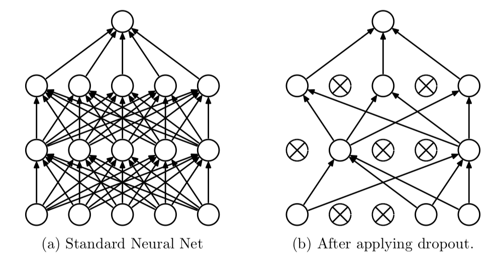

# Regularization

The regularization techniques help to improve a model and allows it to converge faster. We have several regularization tools at our end, some of them are **early stopping, dropout, weight initialization techniques, and batch normalization**. The regularization helps in preventing the over-fitting of the model and the learning process becomes more efficient.

As the model is trained over several epochs, it begins to understand the patterns in the dataset, so when the model is overfitting, the accuracy of the training data would be very high and that of the validation very low, because the model has learned all the patterns in the training data but cannot generalize and make good predictions on data it has not seen before, **which defeats the whole purpose of training the model, which is to make predictions in the future on data it has not seen before**. What we want to achieve is to **reduce overfitting, a situation where the accuracies of our training and validation is close and also high**, which suggests that the model can make better predictions on data it has not seen before.

### Batch Normalization

Normalization is a data pre-processing tool used to bring the numerical data to a common scale without distorting its shape. Generally, when we input the data to a machine or deep learning algorithm we tend to change the values to a balanced scale. The reason we normalize is partly to ensure that our model can generalize appropriately.

Batch normalization, it is a process to make neural networks faster and more stable through adding extra layers in a deep neural network. The new layer performs the standardizing and normalizing operations on the input of a layer coming from a previous layer. And  a typical neural network is trained using a collected set of input data called **batch**. Similarly, the normalizing process in batch normalization takes place in , not as a single input.


Initially, our inputs X1, X2, X3, X4 are in normalized form as they are coming from the pre-processing stage. When the input passes through the first layer, it transforms, as a sigmoid function applied over the dot product of input X and the weight matrix W.


Although, our input X was normalized with time the output will no longer be on the same scale. As the data go through multiple layers of the neural network and L activation functions are applied, it leads to an internal co-variate shift in the data.

Batch Normalization is a two-step process. First, the input is normalized, and later rescaling and offsetting is performed.

* Normalization is the process of transforming the data to have a mean zero and standard deviation one
* In the final operation, the re-scaling and offsetting of the input take place. Here two components of the BN algorithm come into the picture, γ(gamma) and β (beta)

So after every hidden layer we add Batch Normalization layer.&#x20;

.png>)

Here I link two paper on Batch Normalization, definitely read them.&#x20;

1. [How Does Batch Normalization Help Optimization?](https://arxiv.org/pdf/1805.11604.pdf)
2. [Batch Normalization: Accelerating Deep Network Training by Reducing Internal Covariate Shift](https://arxiv.org/pdf/1502.03167.pdf).&#x20;

```python
# code for batch normalization in tensorflow 
```

### Dropout

Dropout is an approach to regularization in neural networks which helps reducing interdependent learning amongst the neurons. **What ?** A fully connected layer occupies most of the parameters, and hence, neurons develop co-dependency amongst each other during training which curbs the individual power of each neuron leading to over-fitting of training data.

Dropout is one of the most effective and most commonly used regularization techniques for neural networks. Dropout, applied to a layer, consists of randomly dropping out (setting to zero) a number of output features of the layer during training .



**Dropout is a technique that drops neurons from the neural network or ‘ignores’ them during training, in other words, different neurons are removed from the network on a temporary basis**.  During training, dropout modifies the idea of learning all the weights in the network to learning just a fraction of the weights in the network. From the figure above, it can be seen that during the standard training phase, all neurons are involved and during dropout, only a few select neurons are involved with the rest 'turned off'. So after every iteration, different sets of neurons are activated, to prevent some neurons from dominating the process.  This, therefore, helps us reduce the menace of overfitting, and allows for the rise of deeper and bigger network architectures that can make good predictions on data the network has not seen before.

```python
# dropout in keras

model = models.Sequential() 
model.add(layers.Dense(16, activation='relu', input_shape=(10000,))) 
model.add(layers.Dropout(0.5)) 
model.add(layers.Dense(16, activation='relu')) 
model.add(layers.Dropout(0.5))
model.add(layers.Dense(1, activation='sigmoid'))
```


Reference:&#x20;

* Batch Normalization \[[https://www.analyticsvidhya.com](https://www.analyticsvidhya.com)]
* Drop Out [\[](https://machinelearningmastery.com)[ai-pool](https://ai-pool.com) ,   [Deep Learning with Python](https://www.amazon.in/Deep-Learning-Python-Francois-Chollet/dp/1617294438/ref=sr\_1\_3?dchild=1\&keywords=deep+learning+with+python\&qid=1633502095\&qsid=258-5056353-5230532\&sr=8-3\&sres=1617294438%2C935213902X%2C8126579919%2C1789955750%2C1789344158%2CB082DHGVT5%2C1789804744%2C1788831101%2CB08R944W66%2C1839210680%2CB079ZW2YWX%2C1787125939%2C1788998081%2C1789348463%2C1491989386%2C1617295264\&srpt=ABIS\_BOOK)]
