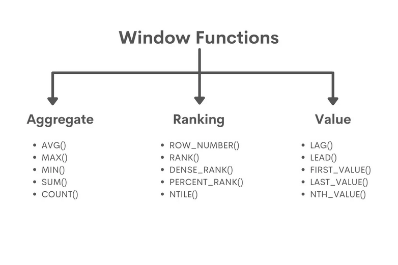

# GAN

The word “generative” indicates the goal of the model: generating new data. The data that a GAN will learn to generate depends on the choice of the training set—for example, if we want a GAN to paint like Pablo Picasso, we would use a training dataset of Pablo’s artwork.

The term “adversarial” represents the competitive dynamic between two algorithms that constitute the GAN framework.

The Generator and the Discriminator. The Generator’s goal is to have data-samples that are indistinguishable from the real data in the training set.&#x20;

Generative Model –Aim to model how data is generated, Generation of synthetic data points, Model class conditional PDFs and prior probabilities, Knowledge about the data distribution – range of possibilities, Probability of x and y (Bayes theorem). Popular models – Gaussian, Naïve Bayes, HMM, Multinomial&#x20;

Discriminative model—Aim to learn P(c|x) by using probabilistic approaches, estimate posterior probabilities, Easy to model, to classify but not to generate data. Popular models – Logistic regression, SVM, Conditional Random Fields and Traditional neural network

<figure><figcaption></figcaption></figure>

There are 4 components of GAN 1. Original data set, 2. Noise, 3. Generator, and 4. Discriminator and loss function.&#x20;

Types of GAN—

1. Deep Convolutional GAN (DCGAN)&#x20;
2. Conditional GAN (CGAN)
3. Auxiliary Class GAN (ACGAN)
4. Wasserstein GAN (WGAN)

### DCGAN

DCGANs has Convolution Neural Networks (CNNs) to build generators and discriminator, Noise or random numbers?&#x20;

Input to Generator –What is Fake data?  🡪 Any type of data which we want Generator to create. Ex: image of a face. Generator and Discriminator for MNIST dataset.&#x20;

<figure><figcaption></figcaption></figure>

<figure><figcaption></figcaption></figure>

Adversarial Network&#x20;

We set up the GAN, which chains the generator and the discriminator.  This is the model that, when trained, will move the generator in a direction that improves its ability to fool the discriminator. This model turns latent space points into a classification decision, “fake” or “real”, and it is meant to be trained with labels that are always “these are real images”.  So training GAN will update the weights of the generator in a way that makes discrimination more likely to predict “real” when looking at fake images. Very importantly, we set the discriminator to be frozen during training (non-trainable): its weights will not be updated when training GAN.

Building DCGAN

* Build Models
  * Generator using Convolution Transpose and noise as input
  * Discriminator with Noise and Real data as input
  * Adversarial (Generator + Frozen Discriminator)
* Training Models
  * Step 1: Train Discriminator using both Real Data and Fake data from Generator
  * Step 2: Train Adversarial Network (indirectly training Generator) using fake data only
  * Repeat Step 1 and 2 till Generator is producing desired outputs

### CGAN

What if we only need 2? Or any other specific number. These are GANs that use extra label information.  This results in better quality images and being able to control – to an extent – how generated images will look.&#x20;

The architecture of CGAN is similar to GAN with an extra variable ‘y’ being added to generator and discriminator to generate images of specific label.

<figure><figcaption></figcaption></figure>

### ACGAN

This architecture is similar to condition GAN. An additional factor in the architecture is that the discriminator not only predicts if an image is fake/real but also the class label of a particular image.

### WGAN

To seek an alternate way of training the generator model to better approximate the distribution of data observed in a given training dataset.&#x20;

Instead of using a discriminator to classify or predict the probability of generated images as being real or fake, the WGAN changes or replaces the discriminator model with a critic that scores the realness or fakeness of a given image.

The Wasserstein loss function seeks to increase the gap between the scores for real and generated images.

* Critic Loss = \[average critic score on real images] – \[average critic score on fake images]
* Generator Loss = - \[average critic score on fake images]

Following are the challenges in training GAN

* Vanishing Gradients&#x20;
* Non-convergence
* Mode Collapse
* Evaluation Metrics
* Unbalance between the generator and discriminator causing overfitting
* Highly sensitive to the hyperparameter selection

Tips for makings GAN trains

* Normalize images between -1 and 1, use tanh as last layer in Generator
* Use Gaussian noise and not Uniform
* Modified Loss function
* Flip labels when training generator
* Avoid Sparse Gradients i.e. avoid Relu and use LeakyRelu
* Use soft and Noisy Labels
* Use Adam
* Add noise to inputs
* Use Dropouts in Generator
