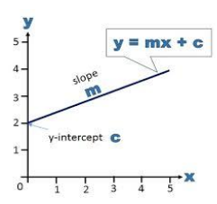

# Decision Tree

1. [https://scikit-learn.org/stable/modules/tree.html](https://scikit-learn.org/stable/modules/tree.html)
2. [https://mlu-explain.github.io/decision-tree/](https://mlu-explain.github.io/decision-tree/)

A Decision Tree is a non-parametric supervised learning model that learns a mapping from inputs to outputs by recursively partitioning the feature space. Instead of learning a smooth function, it divides the input space into rectangular regions and assigns a constant prediction within each region. Because of this, decision trees are best understood as rule-based models rather than function approximators. &#x20;

The construction of a decision tree is greedy and recursive. At each node, the algorithm searches over all possible features and all possible split points to find the split that best reduces impurity. This greedy nature is important: the globally optimal decision tree is an NP-hard problem, so practical implementations rely on local decisions that are not guaranteed to be globally optimal. This explains many of the edge cases and failure modes observed in practice.

Decision tree is a classifier that results in flowchart-like structure with nodes and edges (Key component). &#x20;

* **Branch/sub-tree**: a subsection of the entire decision tree.&#x20;
* **Root Node**: no incoming edge and zero or more outgoing edges.&#x20;
* **Internal Node**: exactly one incoming edge and zero or more outgoing edges.&#x20;
* **Leaf/Terminal Node**: exactly one incoming edge and no outgoing edge.

A **leaf node** in a decision tree is the terminal node at the bottom of the tree, where no further splits are made. Leaf nodes represent the final output or prediction of the decision tree. Once a data point reaches a leaf node, a decision or prediction is made based on the majority class (for classification) or the average value (for regression) of the data points that reach that leaf.

<figure><figcaption></figcaption></figure>

A decision tree is built from top to bottom. That is we begin with the root node, While constructing a decision tree we try to achieve pure nodes. A node is considered to be pure when all the data points belong to the same class. This purity of nodes is determined using the entropy value or gini index.

To select the root node, from k features, select the feature with the highest information gain and split the data on this feature, at the next node, from (k-1) features, select the feature with the highest information gain and again split the data on this feature, continue the process till you exhaust all features

* To check mathematically if any split is pure split or not we use **entropy** or **gini** **impurity**.&#x20;
* **Information Gain** helps us to determine which features need to be selected

If you need to choose between attributes with same information gain, then the first predictor found from left to right in a data set is considered, some decision tree algorithm implementations might consider each of the variables with same information gain at a time and check which model performs better. This rule applies to all parent nodes.&#x20;

Decision trees are prone to overfitting, and this occurs when the decision tree uses all of the data samples in the decision tree, resulting in a perfect fit. An overfitted tree may have leaf nodes that contain only one sample, i.e., singleton node and overfitted tree are generally complicated and long decision chains. An overfitted tree has low training error and a high generalization error, hence can not be generalized for new data.&#x20;

Approach to handle overfitting is **pruning.** Pruning is a technique that removes the branches of a tree that provide little power to classify instances, thus reduces the size of the tree.&#x20;

* Pre-Pruning: The decision tree stops growing before the tree completely grown
* Post-Pruning: The decision tree is allowed to grow completely and then prune

**Hyperparameters**: Pre-pruning can be done by specifying the following hyperparameters.

* **max\_depth**: maximum length of the decision allowed to grow
* **min\_samples\_split**: minimum samples required to split an internal node
* **max\_leaf\_nodes**: maximum number of leaf nodes the decision tree can have
* **max\_feature\_size**: maximum number of features to be considered to while splitting a node
* **min\_samples\_leaf**: minimum samples required to be at the leaf node

**Algorithms**: Decision Tree uses following algorithms&#x20;

* ID3 Algorithm: only categorical data
* C4.5 Algorithm: both categorical, numeric data and missing values '?'
* C5.0 Algorithm: Work faster and more memory efficient than C4.5
* CART

### **Measures of Purity of a node**

#### **Gini Impurity |** Entropy | Information Gain

In a **decision tree**, at each node we want to answer a very precise question: _How mixed are the class labels at this node?_  And if a node contains only one class, it is **pure** and needs no further splitting or if it contains multiple classes in similar proportions, it is **impure**, and we should split it. **Gini Impurity is a quantitative measure of this “mixedness.”**

In case of Binary classification problem, a **Decision Tree** recursively splits data based on feature values to create **pure leaf nodes** (mostly one class: 0 or 1).

&#x20;At each split, the tree asks: Which feature and threshold best separate the two classes? and To answer this, we use **impurity measures**: Gini Index, Entropy and and a **split criterion** Information Gain.

**Entropy** is a Measure of Uncertainty (If I randomly pick one sample from this node, how hard is it to guess its class correctly?), it measure **how mixed the classes are** in a node, High entropy → classes are mixed and Low entropy → node is pure which is low Uncertainty that means if we randomly pick any sample from node we'll get same data point for given class.&#x20;

For binary classification (Class 0, Class 1) entropy would be (non empty class) :-&#x20;

$$
\mathrm{Entropy}(S) = -p_0 \log_2(p_0) - p_1 \log_2(p_1)
$$

where p0​ = proportion of class 0 and p1​ = proportion of class 1

For example, a node has 8 positive and 2 negative class, entropy for that node would be&#x20;

$$
p_1 = 0.8,\; p_0 = 0.2,\;
\mathrm{Entropy} = -0.8 \log_2(0.8) - 0.2 \log_2(0.2) \approx 0.72
$$

**Gini** measures how often a randomly chosen sample would be misclassified if labeled according to class probabilities. Used by **CART** decision trees (e.g., scikit-learn)

$$
\text{Gini} = 1 - \left(p_0^2 + p_1^2\right)
$$

$$
\text{Gini}
= 1 - \left(0.8^2 + 0.2^2\right)
= 1 - \left(0.64 + 0.04\right)
= 0.32
$$

For the same values, Entropy was 0.72 and Gini is 0.32&#x20;

* Entropy -->  **0** → perfectly pure node and Entropy = **1** → completely mixed (50–50)
*   Gini -->  **0** → pure node and Gini = **0.5** → maximum impurity (binary case)

    &#x20;

**Information Gain** tells us how much uncertainty is reduced after a split or How much entropy did we remove by splitting on this feature?

$$
\text{Information Gain}
= \text{Entropy}(\text{parent})
-  \sum_{i=1}^{n} \frac{|S_i|}{|S|}\,\mathrm{Entropy}(S_i)
$$

* S = parent node, Si​ = child nodes after split, |S| = total number of sample, |Si| = number of sample in the child _**i**_

**Example :-**&#x20;

Decision Tree is made total **10** number of sample and entropy for parent node is **0.94,** based on this data tree is split into two nodes&#x20;

1. Left Child having 4 samples with all the same class, and for this entropy would be 0.0
2. Right Child having 6 samples with mixed classes, and entropy for this would be 0.8

Now calculate weight and weighted entropy

$$
\frac{|S_{\text{left}}|}{|S|} = \frac{4}{10} = 0.4,\quad
\frac{|S_{\text{right}}|}{|S|} = \frac{6}{10} = 0.6
$$

$$
\mathrm{Entropy}_{\text{after split}} = (0.4 \times 0.00) + (0.6 \times 0.81) \approx 0.46
$$

Now weighted entropy after split = **0.46**

So information gain would be :-&#x20;

$$
IG=0.94−0.46=0.48
$$

Higher **Information Gain** → better split &  Low Information Gain → weak split

***

**Let's break down how a decision tree takes data with 3 classes and progressively splits the feature space into distinct regions.**

Imagine we have a classification problem with the following attributes:&#x20;

* **Features**: We will use a 2D feature space, let's call them Feature $$X1​$$ (x-axis) and Feature $$X2​$$ (y-axis).
* **Classes** (The Target): We have 3 distinct categories we want to predict:
  * Class A (Red Circles ●)
  * Class B (Blue Squares ■)
  * Class C (Green Triangles ▲)

1. At the very beginning, before any splitting, the decision tree considers the entire dataset. In feature space, this looks like a giant box containing a messy mixture of all three types of points.
2. **The Core Mechanism (Axis-Aligned Splitting) :** A standard decision tree (like CART or C4.5) makes "axis-aligned" splits. This means it cannot draw diagonal lines or curves. It can only draw straight lines that are :- Vertical (e.g., "Is X1​>5?") and Horizontal (e.g., "Is X2​≤3?")
3.  **With 3 classes,** the tree doesn't just look for a split that separates "Class A from the rest."

    It uses a metric like Gini Impurity or Entropy (Information Gain). These metrics calculate how "mixed" a specific region is.

    * A region with only Red circles is perfectly pure (Impurity = 0).
    * A region with an equal mix of Red, Blue, and Green is maximally impure.

    The tree tests _every possible split point on every feature_ and selects the single split that results in the largest overall decrease in impurity across the resulting children nodes.
4.  **The First Split (The Root) :**&#x20;

    The algorithm analyzes all data. It realizes that a vertical line at $$X1​=5$$ does the best job of performing an initial separation.

    * The Decision Rule: Is $$X1​≤5$$?
    * The Result in Feature Space: A vertical line divides the entire plane into a "Left Region" and a "Right Region."
    * _Left Region (_$$X1​≤5$$_):_ Turns out, this region is almost entirely filled with Blue Squares (Class B). It is highly pure.
    * _Right Region (_$$X1​>5$$_):_ This region is still a messy mix of Red Circles (A) and Green Triangles (C).

    > Tree View: The root node splits into two child nodes. The left child is nearly pure Class B. The right child is impure (A+C mix).

&#x20;5\. **Splitting the Impure Region :**- The tree looks at its current regions.

* The Left Region (Blue) is pure enough; it stops growing that branch. This region becomes a "Leaf Node" predicting Class B.
* The Right Region (Red/Green mix) needs work.

The algorithm now focuses _only_ on the data points in that Right Region. It finds that a horizontal split at $$X2​=7$$ works best to separate the remaining reds and greens.

* The Decision Rule: (Given $$X1​>5$$), Is $$X2​≤7$$?
* The Result in Feature Space: A horizontal line is drawn _only within the right half of the graph_.
* _Bottom-Right Region (_$$X2​≤7$$_):_ This area captures almost all the Red Circles (Class A).
* _Top-Right Region (_$$X2​>7$$_):_ This area captures almost all the Green Triangles (Class C).

> Tree View: The right child node splits again based on $$X2​$$. We now have two new terminal nodes (leaves) for Class A and Class C.

6. **Finalizing the Decision Boundaries :**- The process stops when regions are pure, or we hit a depth limit. The final result in feature space is a set of rectangular regions, each assigned to one of the three classes.
   1. Any new data point falling in the left rectangle is predicted as Blue.
   2. Any point in the bottom-right rectangle is predicted as Red.
   3. Any point in the top-right rectangle is predicted as Green.

<figure><figcaption></figcaption></figure>

&#x20;**Notes :-**&#x20;

* How does decision tree split it's node -> based on node purity (Entropy, Information Gain)
* Pruning in decision tree -> to handle the overfitting
* &#x20;Entropy -> Used in selecting the right features in splitting the node, also helps in measuring the purity of the node

