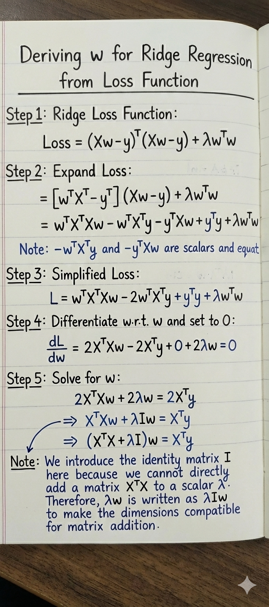
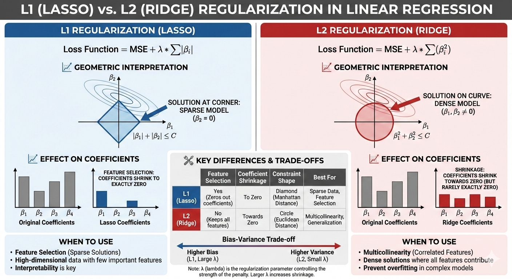

# Regularization

Regularization is a technique used in linear models to prevent over-fitting by adding a penalty term to the loss function. Regularization is achieved by constraining the model coefficients / weights so the model generalizes better to unseen data—especially important when you have many features, multi-collinearity, or limited data.

What we mean by constraining the model weights is that, in linear model weights w decide how strongly each feature affects the prediction. Constraining weights means: we restrict how large or extreme these weights are allowed to become. Because models’ objective is to reduce the MSE (error), so the model is free to assign very large positive or negative weights, thus we need regularization.&#x20;

1. Ridge Regularization (L2 norm)
2. Lasso Regularization (L1 norm)
3. Elastic Net

#### Ridge Regression (L2):

This forces the learning algorithms not only to fit the data but also keep the model's weights as small as possible. Note that the regularization should be added to the cost function during training, and once a model is trained we should use the un regularized performance measure to evaluate the model performance.&#x20;

λ∑w, a regularized term is added to the cost function, and hyper-parameter λ controls the regularization, if λ = 0 then then it’s simple linear regression and λ is very large then all the weights ends up very close to zero and results is a flat line. It shrinks coefficients toward zero but never makes coefficients exactly zero.  We should use Ridge when we have many correlated features and want stability rather than feature selection because it shrinks weights uniformly which leads to stability.&#x20;

coef\_ in the ridge shrinks towards zero but never becomes zero because The L2 penalty forms a smooth, circular (elliptical) constraint region and The loss contours (from least squares) are also smooth ellipses and because both are smooth, the minimum almost never lands exactly on an axis.<br>

1. How does coef\_(model parameter) get affects with ridge regression → Shrinks towards zero but never became to zero \[because the relationship b/w Dependent variable(target) feature and independent (input) features are defined by these coef\_, and if they become very larger or small then it can affect the model performance, even leading to model over-fitting.&#x20;
2. Higher values are impacted more :- Higher the coef\_ the more it gets affected&#x20;
3. Effect on bias variance tradeoff :-&#x20;
4. Impact on Loss Function

For **Ridge Regression** with **n-dimensional data**, the loss function is simply **Mean Squared Error + L2 penalty**.

Following is loss function understanding and then derivation to derive the model parameters :&#x20;

Start with plain squared error (scalar form), For **one data point** with n features and Error for that point would be (y - y<sup>^</sup>)<sup>2</sup>

$$
\hat{y}_i = w_1 x_{i1} + w_2 x_{i2} + \dots + w_n x_{in}
$$

Loss for all data points (still scalar), for m samples

$$
\text{Loss} =
\sum_{i=1}^{m}
\left(
y_i - \sum_{j=1}^{n} w_j x_{ij}
\right)^2
$$

Convert prediction into matrix form&#x20;

$$
X =
\begin{bmatrix}
x_{11} & x_{12} & \dots & x_{1n} \\
x_{21} & x_{22} & \dots & x_{2n} \\
\vdots & \vdots & \ddots & \vdots \\
x_{m1} & x_{m2} & \dots & x_{mn}
\end{bmatrix}


w =
\begin{bmatrix}
w_1 \\
w_2 \\
\vdots \\
w_n
\end{bmatrix}


y =
\begin{bmatrix}
y_1 \\
y_2 \\
\vdots \\
y_m
\end{bmatrix}
$$

Prediction for **all samples at once**: y^ = X \* _w_&#x20;

&#x20;Squared error using vectors, Error vector:&#x20;

$$
\\ y - Xw
$$

Squared error sum = dot product with itself, and OLS loss in matrix form becomes:

$$
\mathcal{L}_{\text{OLS}}
=
(y - Xw)^\top (y - Xw)
$$

By Converting Ridge penalty to matrix form weight vector to dot product, So Ridge penalty becomes

$$
\lambda w^\top w
$$

Combine OLS loss + Ridge penalty

$$
\mathcal{L}_{\text{Ridge}}
=
(y - Xw)^\top (y - Xw)
+
\lambda w^\top w
$$

$$
\text{Ridge Regression minimizes squared error while penalizing the } \ell_2 \text{ norm of the weight vector.}
$$

**Following is walk-through on driving model parameter from the loss function of Ridge :**

<figure><figcaption></figcaption></figure>

Code (Ridge Regression)&#x20;

```python
# Building Ridge Regression using Closed Form equation (OLS)

class RidgeRegression:
    def __init__(self, alpha = 0.1):

        self.alpha = alpha
        self.coef_ = None
        self.intercept_ = None

    def fit(self, X_train, y_train):

        X_train = np.insert(X_train, 0, 1, axis=1) # inseting a column with values of 1 for model parameter 
        I = np.identity(X_train.shape[1]) # currently all the dignonal values are set to 1 are remaining to 0

        # first index setting to 0, because the 1st column have intercept(bias) not the slope and we need to regularize the slope
        # because Intercept does not control model complexity and penalizing it introduces bias unnecessarily
        I[0][0] = 0  

        result = np.linalg.inv(np.dot(X_train.T, X_train) + self.alpha * I).dot(X_train.T).dot(y_train)

        self.intercept_ = result[0]
        self.coef_ = result[1:]

    def predict(self, X_test):
        return np.dot(X_test, self.coef_) + self.intercept_
```

#### Lasso Regression (L1):

L1 shrinks some weights to zero which can be helpful in feature selection.

Lasso regression is a linear model with L1 regularization that adds an absolute-value penalty on coefficients, leading to sparse solutions and automatic feature selection. It trades increased bias for reduced variance, improves interpretability, but struggles with correlated features and requires careful feature scaling.

#### Elastic Net :&#x20;


<figure><figcaption></figcaption></figure>

**Note :-**&#x20;

The obvious disadvantage of ridge regression is model interpretability. It will shrink the coefficients for least important predictors, very close to zero. But it will never make them exactly zero. In other words, the final model will include all predictors. However, in the case of the lasso, the L1 penalty has the effect of forcing some of the coefficient estimates to be exactly equal to zero when the tuning parameter λ is sufficiently large. Therefore, the lasso method also performs variable selection and is said to yield sparse models.

1. Always standardize features before applying regularization
2. Intercept term is usually not regularized
3. λ is chosen using cross-validation
4. Lasso may be unstable when features are highly correlated → use Elastic Net

