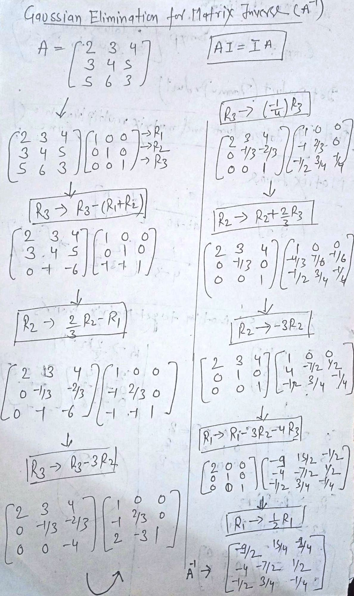

# Linear Algebra

## Basic Terminology

Linear Algebra is equal to Vectors (V) and Matrices (M) and operation on them, V and M are objects in space with various dimensions.&#x20;

* Scalar - Only magnitude &#x20;
* Vector - Direction & Magnitude (1d array of numbers)
* Matrices - 2d array of numbers ( can be represented transform/multiple vectors)
* Tensors  - N-dimensional array of numbers


* Line  -  Equation of a line in two dimensions is : `y = mx + c`&#x20;

.png>)

* Plane - A line in three dimensions called a plane and its equation is given by: `ax+by+cz = d`
* Hyperplane - A hyperplane is a subspace whose dimension is one less than that of its ambient space.&#x20;

&#x20;      If space is 3D,  then hyperplane is 2d and its equation is given by &#x20;

$$
a_1x_1 + a_2x_2 + a_3x_3  ... + a_n  = d
$$

## Where you can apply linear algebra as a ML engineer

* Formulation of Machine Learning problems
* Image Processing&#x20;
* Dimensionality Reduction
* Natural Language Processing
* Recommendation System
* Computer Vision

## Vectors

Sybmol of vector: **→**    Symbol of unit vector  **^**

.png>)

The magnitude of Vector: The length of a vector is called the magnitude/norm of a vector. There are two norms L1 and L2.

L1 Norm - Computes Manhattan distance &#x20;

$$
||u||  = |x_1| + |y_1|
$$

```
# Linear algebra in Python 

import numpy as np
import scipy.linalg as la

u = np.array([1,2])

np.linalg.norm(u, ord=1)  
```

L2 Norm: Computes Euclidean distance&#x20;

$$
||u|| = \sqrt{x_1^2 + y_1^2}
$$

```
np.linalg.norm(u)  # Euclidean Distance
```

**Vector Properties**

* Associativity of addition  `u + (v + w) = (u + v) + w`
* Commutativity of addition  `u + v = v + u`
* Distributivity of scalar multiplication with respect to vector addition           `a(u+v) = au + av`
* Multiplicative identity is 1&#x20;

```
# Vector Arithmetic

u = np.array([1,2])
v = np.array([3,4])

u + v  #Addition
u - v  #Subtraction
u * v  #Multiplication
u / v  #Division
```

**Vector Operations**

* Dot Product

```
a = np.array([[1, 2], [3, 4]])
b = np.array([[5, 6], [7, 8]])

np.dot(a, b) 

a@b
```

Scalar Projection: A scalar projection of u onto v is the length of the shadow that u casts on v.&#x20;

 (1).png>)

```
u = np.array([6, 7])
v = np.array([5, -12])

sc_proj = np.dot(u, v) / np.linalg.norm(v)
```

Vector Projection: A vector projection of u onto v is the vector in the same direction as v, whose length is the scalar projection of u on v. The scalar projection is the magnitude of vector projection.&#x20;

.png>)

```
vec_proj = (v * sc_proj)/ np.linalg.norm(v)
```

> Q. Find out the scalar projection, vector projection and orthogonal component of (6i + 7j) onto (5i -12j).

$$
Sp  = ( 6*5 + 7*(-12) ) /\sqrt{5^2 + (-12)^2}
$$

$$
Vp  = ( Sp * (5i -12j) ) /  \sqrt{5^2 + (-12)^2}
$$

$$
Oc = (6i + 7j) - Vp
$$

**Linear Independence**

A set of vectors is linearly dependent, if one of the vectors can be defined as a combination of others vectors. Hence, for vectors to be linearly independent, the linear combination of the vectors results in zero vector, if and only if all the constants are zero.&#x20;

$$
c_1v_1 + c_2v_2 + ...  + c_nv_n = 0 ,    c_1 = c_2 ...c_n = 0
$$

* Direction of two linearly dependent vectors is the same. This shows that there can be only as many solutions as the no. of independent vectors.
* Determines if the vector form a basis
* Determines the no of independent equations
* Determine the no. of independent vectors&#x20;















**Change of basis**

Change of basis is a technique applied to finite-dimensional vector space in order to rewrite vectors in terms of a different set of basis elements. The basis is set of N vectors&#x20;

* that are linearly independent
* spans the space with the N dimensions  &#x20;

Orthonormal Basis: Two vectors are orthogonal when their dot product is zero. When the basis is orthogonal and normalized, the basis is orthonormal.&#x20;

Extra Resource:




















## Matrix

* Matrix transform Space/vector
* Change of basis can be effected through a matrix transform
* Properties&#x20;
  * Associative   `A + B = B + A`
  * Transpose     `A = AT`
  * Identity Matrix
  * Upper triangular Matrix
  * Lower triangular Matrix
  * Diagonal Matrix&#x20;
  * Orthogonal Matrix   `A.AT = AT.A  = I`&#x20;

.png>)

```
# matrix creation in python 

np.zeros((3,3))

np.ones((3,3))

np.full((3,3), 1)

np.eye(3)

M = np.array([
[1, 2, 3],
[4, 5, 6],
[7, 8, 9]])

lower = tril(M) # lower triangular matrix
upper = triu(M) # upper triangular matrix
d = diag(M)     # extract diagonal vector
V = inv(M)      # inverse equivalence
```

### Linear Transformations

* **Scale Transformation**
* **Reflection Transformation**
* **Projection Transformation**
* **Rotation Transformation**
* **Identity Matrix Transformation**


**Matrix Properties**

* Not commutative  `AB ≠ BA`
* Dot/Inner Product  `A(BC) = (AB)C`
* `A*I = A`
* Matrix Multiplication (A columns need to be equal to B rows)

$$
C m*p = Am*n ×  Bn*P
$$

### Matrix Inverse

The Inverse of matrix A can be written as:

.png>)

.png>)

**Gaussian Elimination** to get Matrix Inverse:



### Orthogonal Matrix&#x20;

A matrix with orthonormal row and column vectors is called an orthogonal matrix. Orthonormal means that the vectors in the basis are orthogonal(perpendicular)to each other, and they each have a length of one.

* An orthogonal matrix Q is necessarily invertible
* &#x20;The determinant of an orthogonal matrix is either +1 or -1

.png>)

**Gram-Schmidt** Process:   Convert a matrix of column vector u1,u2...Un to an orthognal matrix v1,v2...Vn.


### Eigen Vector and Eigen Values&#x20;













## &#x20; Application of Linear Algebra:

**Picture**:&#x20;

* Computers use a discrete form of pictures •
* The process of transforming continuous space to discrete space is called digitization&#x20;
* Steps in digitization 1. Picture 2. Sampling + Quantization 3. Digital picture

A (2D) picture P is a function defined on a (finite) rectangular subset G of a regular planar orthogonal array. G is called (2D) grid, and an element of G is called a pixel. P assigns a value of P(p) to each point.

**Pixels**:&#x20;

PIXELS are ATOMIC ELEMENTS called PICTURE ELEMENTS of a digital image.&#x20;

* It is the smallest element of an image represented on the screen.&#x20;
* A pixel can have values ranging from 0 to 255. • Where 0 is black and 255 is white.&#x20;
* Images are stored as rectangular arrays of pixels.&#x20;
* Each pixel can be thought of as a single square point of colored light.

**Channels**&#x20;

* Images can have different channels. Examples - RGB, BGR&#x20;
* R - Red, G - Green, and B -Blue&#x20;
* In the RGB model, the colors are stored as RGB values – red in layer 0, green in layer 1, blue in layer 2.&#x20;
* Grayscale image has just one channel.

**Intensity** **Values**&#x20;

* If: R=255, G =255, B = 255, then that pixel is white&#x20;
* If R =0, G = 0, B= 0, then the pixel is black&#x20;
* If R, G, and B are any values in the range(1,255), then the pixel has a particular color shade based on the corresponding intensity values.&#x20;
* Spatial Domain - 2D - the physical 2D location of the pixels&#x20;
* Intensity domain - 3rd Dimension - the actual pixel value

**Image Representation**: Image is represneted as n-dimensional array where each pixel is a vector(1d array(\[R,G,B]) of intensity values).&#x20;

* GrayScale Image&#x20;
* Color Image \[[LINK](https://ai.stanford.edu/~syyeung/cvweb/tutorial1.html)]

.png>)

### **Image Processing**

* **Intensity Transformation – Filtering \[**[LINK](https://setosa.io/ev/image-kernels/)**]**

When the color of every pixel is changed, using a function that gets as input the original pixel, or in more complex cases, a submatrix of pixels (_adjustment of brightness, contrast, and colors,_ grayscale conversion, color inversion (negative), gamma correction, _blur and noise reduction)_.

**Filters/ Kernels:** An image kernel is a small matrix used to apply effects, such as blurring, sharpening, outlining, or embossing. They're also used in machine learning for 'feature extraction', a technique for determining the most important portions of an image. In this context, the process is referred to more generally as "convolution".

.png>)

&#x20;                                         **I \* W = ∑ ∑ I(K,L) W(i+K, j+L)**

* Kernel is also called convolution matrix, mask or filter
* Convolution with different kernels can be used for different image transformations/filtering
* You can use different kernels for different Feature extraction like edge detection, Sharpen, blurring, etc.


* **Spatial Affine Transformation**

When the pixels change their position inside the image, or most precisely when every pixel in the matrix is build based on another pixel of the matrix, but without altering its color. (_Rotation, flips, scaling, skewing, and translation_).

* A spatial transformation of an image is a geometric transformation of the image coordinate system.
* An affine transformation is any transformation that preserves collinearity(i.e., all points lying on a line initially still lie on a line after transformation) and ratios of distances (e.g., the midpoint of a line segment remains the midpoint after transformation).

```
# Different ways of reading an image
	
	# Pillow
		img = Image.open('download.png')
		
	# Matplotlib
		from matplotlib.image import imread
		imgarr=plt.imread('download.png')
		
	# skimage
		from skimage import io
		myimage = io.imread('download.png')
		plt.imshow(myimage)
```

## Linear Transformation&#x20;

* Identity&#x20;
* Scaling &#x20;
* Rotation &#x20;
* Translation &#x20;
* Horizontal Shear&#x20;
* &#x20;Vertical Shear

## Functions, Derivatives, and Integrals


## **Principal Component Analysis**

**PCA** is a dimensionality-reduction method that is often used to reduce the dimensionality of large data sets, by transforming a large set of variables into a smaller one that still contains most of the information in the large set or keeps its covariance structure as much as possible.&#x20;

In practice, this algorithm is used for data points that are not necessarily random and In statistics, PCA can be used for estimation.





















## Matrix Factorization: SVD

Matrix Decomposition, also known as matrix factorization involves describing a given matrix using its constituent elements. The most widely used matrix decomposition method is SVD(**Singular Value Decomposition)**. As such, it is often used in a wide array of applications including compressing, denoising, and data reduction.&#x20;

&#x20;Given a square or non-square matrix A, linear algebra theorem SVD specifies that:

$$
A = U Σ V^t
$$

* Where U and V are orthogonal matrices and Σ is a diagonal matrix.
* The matrices are orthogonal so: U^T.U = V^T.V = I
* The columns of U are orthonormal eigenvectors of AA^T, the columns of V are orthonormal eigenvectors A^T.A
* Σ is a diagonal matrix containing the square roots of eigenvalues from U or V in descending order.

A is a matrix that can be seen as a linear transformation. This transformation can be decomposed into three sub-transformation 1. rotation, 2. re-scaling(stretch), and 3. rotation and these three steps correspond to the three matrices U, Σ, and V. The general rule is that the transformation associated with diagonal matrix (Σ) implies only a rescaling of each coordinate without rotation.&#x20;

Steps involved in forming SVD matrices:

* Calculate Transpose of matrix A(which needs to be factorized)
* Find the eigenvalues and eigenvector of A.A\_transpose
* Form matrix U using columns of eigenvector
* Form orthogonal matrix U by normalizing above U matrix
* Calculate matrix using same above steps but based on A^T.A
* Form matrix E by taking the square root of nonzero eigenvalues.

SVD used in the recommendation System, Signal Processing, and Image processing.&#x20;

Example(Problem):





















