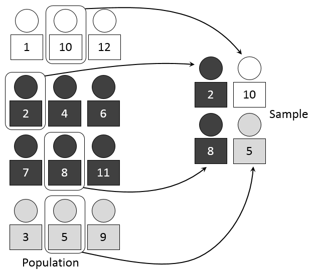

# Statistics

There are two type of statistical learning

1. Descriptive statistics
2. Inferential statistics

Descriptive statistics **summarize a given data set.** It includes _measures of central tendency_ ( mean, median, and mode), _measures of variation_ (standard deviation, variance, the coefficient of variation) and _distribution of the data_. Goes with only historical data.

Inferential statistics are procedures that help in making inferences about a population based on findings from a sample.It includes **testing of hypothesis** and **parameter estimation.**

### **Variable Type**

Identifying the type of variable we are working with is always the first step of the data analysis process.

1. **Numerical (Quantitative)**
   1. Continuous : A random variable which takes continuous values, i.e. values within a range, usually measured, such as height

*
  1. Discrete : Values from the set of whole numbers only. It can take countably finite values, can’t have decimal values. (Age, No of bathroom)

1.  **Categorical (Qualitative)**

    1. Ordinal : Values that have inherent ordering levels, such as (high, medium, low)
    2. Nominal : Nominal data has no order. The values represent discrete units and are used to label variables (male or female), ID number, zip code


### **Measures of Central Tendency**

* Mean

&#x20;Mean is average of data, and it includes all values in the data, thus it can be affected by the outliers and presence of outliers can give unreliable results.

```
dataset.mean()
```

Trimmed Mean : Mean value is affected by the extreme observations, so use trim mean. Function can be obtained from the stats module of the library scipy and function computes trimmed mean of set of observations, we cannot pass the data frame itself.

```
import scipy
from scipy import stats
scipy.stats.trim_mean(data, proportiontocut = 0.20))
```

`proportiontocut - fraction of data points to cut off of both tails of the distribution`

_Trimmed Mean < Mean Value_ : there are many extreme observations/outlier

* Median

&#x20;The median value is the middlemost value of the dataset, it divides the data into two equal halves. Unlike mean, the median value is not affected by extreme values. The median value is at times used to impute the missing values in the data.

```
data.median()
```

* Mode

&#x20;Mode of the data is the value which has the highest frequency, It is a measure that can be used for categorical variables. Example: gender

```
data.mode()
```

#### **Partition Values (Quantiles)**

Median divides the data into two equal halves. Similarly, in order to divide the data into four equal parts we use quartiles. Quartiles are the data points which partitions the data into 4 equal parts. So, there are 3 quartiles.

* **The first quartile** is the point that partitions the first 25% of the data and later 75%. This means that 25% of the data are less than or equal to the first quartile and 75% of the observations are greater than or equal to the first quartile. _Same as 25th percentile._

data.quantile(0.25) # use function quantile to get the quartile

* **The second quartile** is the point that partitions the data in two equal parts also known as median. This means that 50% of the data are less than or equal to the second quartile and 50% of the observations are greater than or equal to the second quartile. _Same as 50th percentile_

data.quantile(0.5)

* **The third quartile** is the point that partitions the data in 75-25 ratio. This means that 75% of the data are less than or equal to the third quartile and 25% of the observations are greater than or equal to the third quartile. _Same as 75th percentile_

data.quantile(0.75)

### **Measure Of Dispersion**

The measure of dispersion indicates the variability within a set of measures. Less variability implies more data is closer to the central observations, more variability implies more data is spread further away from the center. The most popular variability measures are the **range, interquartile range(IQR), variance and standard deviation.**

* **Range :**

&#x20;It represents the difference between the largest and the smallest points in the data, In spite of being very easy to define and calculate, it’s not a reliable measure because it is highly affected by extreme values.

&#x20;Range = max - min

* &#x20;**IQR**

The interquartile range is another useful measure of spread based on the quartiles, It is the difference between the third quartile and the first quartile and gives the range of middle 50% of the data. It also helps in identifying the outliers.

data.quantile(0.75)-data.quantile(0.25)

The IQR gives the range in which the middle 50% of the data lies. **The smaller the range is, lesser is the dispersion.**

* **Variance**

Variance measures the dispersion of the data from the mean, it is an average of the sum of squares of the difference between an observation and the mean, thus it is always positive. The variance is based on all the observations.

&#x20;data.var()

It is a better measure of variability than range. It tells how spread the data is.

* **Standard Deviation**

Standard deviation is the positive square root of the variance, It has the same unit as that of the observations, Like variance, it also measures the variability of the observations from the mean.

&#x20;1 sd -- 68% away

&#x20;2 sd -- 95% away

&#x20;3 sd -- 99.7% away

data.std()

* **Coefficient of Variation**

The coefficient of variation is a statistical measure of dispersion of data points around the mean, We compare the coefficient of variation in order to decide which of the two sets of observations has more spread. It is a unit free measure and is always expressed in percentage.

```
from scipy.stats import variation 
scipy.stats.variation(data_series)
```

**Lesser coefficient of variation, the better the data is.**

### **Distribution of the Data**

The distribution is a summary of the frequency of values taken by a variable, the distribution of the data gives information on the shape and spread of the data. On plotting the histogram or a frequency curve for a variable, we are actually looking at how the data is distributed over its range.

&#x20;Normal Distribution :


**Shape of the Data**

* **Skewness**

Skewness helps us to study the shape of the data.It represents how much a distribution differs from a normal distribution, either **to the left or to the right**.The value of the skewness can be either positive, negative or zero.

&#x20;data.skew() used fisher-pearson coefficient of skewness

negatively skewed distribution, _mean_<_median_<_mode_

positively skewed distribution, _mean_>_median_>_mode_


Bowely’s coefficient of skewness defined as

S = Q3-2 \*Q2+Q1 / Q3-Q1 (Based on Quartiles)

&#x20;Karl Pearson’s coefficient of skewness defined as

S = 3(mean - median) / standard deviation (Based on mean,median,sd)

&#x20;Fisher Pearson’s coefficient of skewness defined as (Based on central Moments m2...)

.png>)

&#x20;The points beyond the whiskers of the boxplot are considered to be **outliers.**

* **Kurtosis**

&#x20;Kurtosis measures the peakedness of the distribution, In other words, kurtosis is a statistical measure that defines how the tails of the distribution differ from the normal distribution. Kurtosis identifies whether the tails of a given distribution contain extreme values

data.kurt()

**Z-score**

Another way to detect outliers are using the z-score. Z-score of a value is the difference between that value and the mean, divided by the standard deviation. If Z-score is positive or negative that means the value is above or below the mean and by how many standard deviations. _**Z-score greater than 3 or less than -3, indicates an outlier value.**_

scipy.stats.zscore(data)

Z score value What does it mean ?

&#x20;0 Value is same as mean

< 0 Value is less than mean

\> 0 Value is greater than mean

< -3 or > 3 Value is potential outlier

**Covariance and Correlation**

**Correlation** shows whether pairs of variables are related to each other, If there is correlation, it shows how strong the correlation is. Correlation takes values between **-1 to +1**, where values close to +1 represents strong positive correlation while values close to -1 represents strong negative correlation.

Corr = data.corr() sns.heatmap(corr, annot = True)

**Covariance** is the relationship between a pair of random variables where change in one variable causes change in another variable. It can take any value between **-infinity to +infinity,** where the negative value represents the negative relationship whereas a positive value represents the positive relationship.

cov = data.cov() sns.heatmap(cov, annot = True)

Correlation tells how strong the relationship is, covariance gives direction of the relationship.

## **Probability (Simple, Joint, Marginal and Conditional)**

* Simple probability refers to the probability of occurrence of a simple event.&#x20;

P (A ∪ B)

Probability of an event X, P(X) is given by

P(X) = Number of observations in favor of an event X / Total number of observations

* Joint probability refers to the probability of occurrence involving two or more events. Probability of two events occurring simultaneously.

Let A and B the two events in sample space, the joint probability if the two events denoted by (A∩B),

&#x20;P(A∩B) = Number of observations in A∩B / Total number of observations

* Marginal Probability refers to the probability of an event without any condition. Two events are mutually exclusive if both the events cannot occur simultaneously. A set of events are collectively exhaustive if one of the events must occur. P(A), P(B).
* Conditional Probability refers to the probability of event A, given information about the occurrence of another event B. Probability of A given B is written as P(A | B).

P(A | B) = P(A and B) / P(B) -- _A occurs only if B occurs_

where P(A and B) = Joint probability of A and B

P(A) = Marginal probability of A, P(B) = Marginal probability of B

**Mutually Exclusive Events** : Two events, A and B are said to be mutually exclusive if they can not occur at the same time. Or occurrence of A excludes the occurrence of B. Example: when a coin is tossed, getting a head or a tail are mutually exclusive as either head or tail will appear in case of an ideal scenario.

**Independents event** : Two events, A and B are independent if the occurrence of A is no way influenced by the occurrence of B. Example : when you toss a fair coin and get head and then you toss it again and get head.

if P(A | B) = P(A), where

P(A|B) is the conditional probability of A given B P(A) is the marginal probability of A

Example: A student getting A grade in both Final Stats exam and in final Marketing exam

### **Rules of Computing Probability :**

* **Addition rule - Mutually Exclusive Event** : P(A ∪ B) = P(A) + P(B)
* **Addition rule - Non Mutually Exclusive Event:** P(A ∪ B) = P(A) + P(B) - P(A ∩ B)
* **Multiplication rule - Independent Event:** P(A ∩ B) = P(A) \* P(B)
* **Multiplication rule - Non Independent Event:** P(A ∩ B) = P(A)\* P(B/A)

**Note :** P(A or B) = P(A) + P(B) - P(A and B) P(A∪B) = P(A) + P(B) - P(A∩B) P(A∪B) is the event that either A or B or both occur. P(A∩B) is the event that both A and B occur at the same time.

**Odds**

**Bayes Theorem**

### **Probability Distribution**

#### **Binomial Distribution**

It is a widely used probability distribution of a discrete random variable. Plays a major role in quality control and quality assurance function. **Only two outcomes** i.e Yes/NO, True/False, Head/Tail or Binary Data.

.png>)where P(X = x) is the probability of getting x successes in n trials and _π_ is the probability of an event of interest.

Python Function for Binomial Distribution :

* Probability mass function

```
binomial = scipy.stats.binom.pmf (k,n,p)
```

Where k is an array and take values in {0,1,2…n } n and p are shape parameters for binomial distribution. The output, binomial, gives probability of binomial distribution function in terms of array.

* Cumulative Density function

```
cumbinomial = scipy.stats.binom.cdf(k,n,p)
```

Gives cumulative binomial distribution. The output, cumulative binomial, gives cumulative probability of binomial distribution function in terms of array.

#### **Poisson Distribution**

This discrete distribution also plays a major role in quality control, the Poisson distribution is a discrete probability distribution for the **counts of events** that occur randomly in a given interval of time or space. In such areas of opportunity, there can be more than one occurrence. In such situations, Poisson distribution can be used to compute probabilities.

Poisson Distribution helps to predict the arrival rate in a waiting line situation where a queue is formed and people wait to be served and the service rate is generally higher than the arrival rate. Examples include number of defects per item, number of defects per transformer produced.

$$
P(X = x) = e^λ λ^x / x!
$$

&#x20;P(x) = Probability of x successes given an idea of _λ_ λ = Average number of successes (mean μ = λ) x = successes per unit which can take values 0,1,2,3,...∞ e = 2.71828 (based on natural logarithm)


If there is a fixed number of observations n, each of which is classified as an event of interest or not an event of interest, use the binomial distribution. If there is an area of opportunity, use the Poisson distribution.


Python function for Poisson Distribution:

* Probability mass function

```
poisson = scipy.stats.poisson.pmf(n, rate)
```

* Cumulative Density function

```
 poisson = scipy.stats.poisson.cdf(n,rate)
```

####

#### **Normal Distribution**

Normal distribution is observed across many naturally occurring measures such as birth weight, height and intelligence etc.


f(x) is used to probability density function x is any value of the continuous variable, where -∞ < x < ∞ e denotes the mathematical constant approximated by 2.71828 Π is a mathematical constant approximated by 3.14159 μ and σ are the mean and standard deviation of the normal distribution

Python function for Normal Distribution :

* Cumulative Density function

```
scipy.stats.norm.cdf(z)         # z = (x-μ) / σ
```

### **Sampling and Estimation**

It is the method of selecting a subset of observations from the population which is used as a representative of the population.

* Simple Random Sampling

It is one of the sampling methods in which each observation in the population has an equal chance (probability) of being selected as the sample and it can be with/without replacement.

In Simple Random Sampling With Replacement (**SRSWR**) an observation can occur multiple times, as we replace the selected observation in the population before drawing the next sample. In this technique, the size of the population always remains the same. If there are \`N\` observations in the population then the probability of drawing \`n\` samples with replacement is 1 / N^n.

&#x20;random.choices(population=data, k =20) k is sample that need to be drawn

In Simple Random Sampling Without Replacement (\`**SRSWOR**\`) an observation can occur only once as we do not replace the selected observation before drawing the next sample. If there are \`N\` observations in the population then the probability of drawing \`n\` samples without replacement is ?????

&#x20;random.sample(population = data, k = 10)

* Stratified Sample

We can use the stratified sampling method to draw a sample from the heterogeneous dataset. The dataset is divided into the **homogeneous strata(**&#x65;qual grou&#x70;**)** and _then a sample is drawn from each stratum_. The final sample contains elements from each stratum. 

* Systematic Sample

This technique can be used to draw a sample in a systematic manner. For the population with size \`N\` if we want to take a sample of size \`n\`, then arrange the population (rows-wise) in \`k\` columns such that, N = nk.

* Cluster Sample

Cluster sampling can be used when the population is a collection of small groups/clusters. This technique selects a complete cluster randomly as a single sampling unit.

random.sample(population = states, k = 5)

**Central Limit Theorem**

Let X1, X2, X3,......Xn be the random sample drawn from a population with mean _𝜇_ and standard deviation _𝜎_ . The central limit theorem states that, for sufficiently large n, the sample mean x̄ follows an approximately normal distribution with mean _𝜇_ and standard deviation sd/sqrt(n).


For a normal distribution population, the above result holds for any sample size. For the population other than normal distribution, generally the sample size greater than or equal to 30 is considered as the large sample size.

### **Parameter Estimation**

The value associated with the characteristic of the population is known as a \`**parameter**\` and the characteristic of the sample is described by a \`**statistic**\`.

Usually, the population parameters are not known in most real-life problems. Thus, we consider a subset of the population (sample) to estimate the population parameter using a sample statistic.

* Point Estimation

This method considers a single value (sample statistics) as the population parameter.Let X1, X2, X3,......Xn be the random sample drawn from a population with mean _𝜇_ and standard deviation 𝜎 .

The point estimation error method estimates the population mean _𝜇 =_ x̄, where x̄ is the sample mean and population standard deviation _𝜎_ = s, where s is the standard deviation of the sample(**standard error**).

&#x20;sample = random.sample(population = data, k = 20) point estimate = np.mean(sample) # point estimate for the population mean

*
  * Sampling Error

Sampling error is considered as the absolute difference between the sample statistic used to estimate the parameter and the corresponding population parameter. Since the entire population is not considered as the sample, the values of mean, median, quantiles, and so on calculated on sample differ from the actual population values.

One can reduce the sampling error either by increasing the sample size or determining the optimal sample size using various methods.

Sample error of mean = Population mean - Sample Mean (point estimated for population mean)

* Interval Estimation

This method considers the range of values in which the population parameter is likely to lie. The confidence interval is an interval that describes the range of values in which the parameter lies with a specific probability. It is given by formula

&#x20;conf\_interval = sample statistic ± margin of error

The uncertainty of an estimate is described by the \`confidence level\` which is used to calculate the margin of error.

*
  * Large Sample Size

Consider a population with mean 𝜇 and standard deviation 𝜎 . Let us take a sample of \`n\` observations from the population such that, n >= 30. The central limit theorem states that the sampling distribution of mean follows a normal distribution with mean 𝜇 and standard deviation 𝜎/sqrt(n). Use **Z-test** if sigma is known.

The confidence interval for population mean with 100(1-𝛼)% confidence level is given as :

 where:

&#x20;X = sample mean 𝛼 = Level of significance 𝜎 = population standard deviation n = Sample size

The quantity is the **standard error** of mean. And **the margin of error** is given by .

If we know the expected margin of error(ME), then we can calculate sample size(n) using below formula :


Replace 𝜎 by the standard deviation of the sample (s) if the population standard deviation is not known. The value of Z𝛼/2 for different 𝛼 can be obtained using the stats.norm.isf() from the scipy library.

_To calculate the confidence interval with 95% confidence, use the Z-value corresponding to \`alpha = 0.05\`._

**→ 90% confidence interval for the population mean**

stats.norm.interval(0.90, loc = np.mean(sample), scale = sd\_population / np.sqrt(length\_of\_sample))

*
  * Small Sample Size

Let us take a sample of n observation from the population such that, n<30. Here the standard deviation of population is unknown. The confidence interval for the population mean with 100(1-alpha)% confidence level is given as : use **T -test** and sigma is not known.

 where:

&#x20;X = sample mean 𝛼 = Level of significance s = sample standard deviation n-1 = degree of freedom

The radio is the estimate of the **standard error** of mean. And is **margin error** of estimate.

Alpha(𝛼) value can be obtained using stats.t.isf() from the scipy library.

&#x20;**→ 90% confidence interval for the population mean**

stats.t.interval(0.90, df = n-1, loc = sample\_avg, scale = sample\_std/np.sqrt(n))

* Interval Estimation for Proportion

Consider a population in which each observation is either a **success or a failure**. The population proportion is denoted by \`P\` which is the ratio of the number of successes to the size of the population.

The confidence interval for the population mean with 100(1-alpha)% confidence level is given as :

 where:

&#x20;p = sample proportion (number of success / sample size) 𝛼 = Level of significance n = sample size


