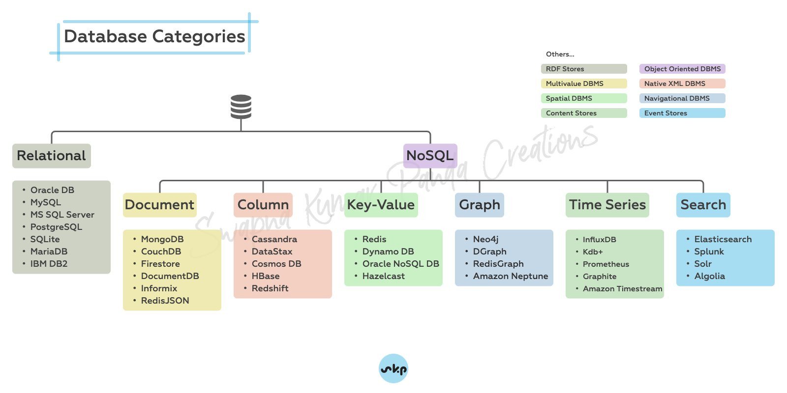

# SQL

[DataLemur](https://datalemur.com/) | [Interview Query](https://www.interviewquery.com/) | [InterviewBit](https://www.interviewbit.com/) | [StrataScratch](https://www.stratascratch.com/) | [Deep-ML](https://www.deep-ml.com/)

**DataBase**

* A database consists of one or more tables
* Each row in table called record or tuple
* Each column in a table is an attribute
* Keys - Data item to uniquely identify a record in a table ( Primary, Unique, Foreign … )

DataBase schema is a blueprint that represents the logical view of the database., defines tables and relationships between them.

<figure><figcaption></figcaption></figure>

Structured Query Language(SQL) as we all know is the database language by the use of which we can perform certain operations on the existing database and also we can use this language to create a database.

SQL commands are mainly categorized into five categories as:

1. **DDL** (Data Definition Language)  → Create, Alter, Drop, Truncate
2. **DML** (Data Manipulation Language) → Insert, Update, Delete
3. **DQL** (Data Query Language) → Select&#x20;
4. **DCL** (Data Control Language) → Grant, Revoke
5. **TCL** (Transactional Control Language) → Commit, Roll Back, Save Point, Set Transaction

<figure><figcaption></figcaption></figure>

**Query order of execution** &#x20;

From  and Joins -> Where -> Group By -> Having -> Select -> Order By -> Limit / Offset

**Constraint**

Used for specifying the rules for data in the table, and can be specified when the table is created.

* Not Null
* Unique
* Primary Key
* Check
* Default

**Wildcard** **Filtering** --> %, -, \_, \[], ^, #

**Aggregate Functions :-** It’s all about performing calculations on multiple rows of a single column of a table and returning a single value. The Group By statement groups rows that have the same values into summary rows, and can contain two or more columns. \[Count, Sum, Avg, Max, Min]

**Where vs Having**&#x20;

1. Where filters the data at row level(an individual record) but Having clause filter the data at the group level(aggregation)
2. Having clause can’t be used without group by(because having works with aggregation and without groupby you cant get aggregate values) but where clause can be used without group by also.&#x20;
3. Where is used before the groupby() and Having is used after the groupby() clause.

**Windows Function**

Work as groupby but no of rows is not reduced (partition by), mostly used for ranking. Following are windows functions :-&#x20;

* row\_number / rank / dense\_rank /lag / lead / first\_value / last\_value
* &#x20;nth\_value / ntile / cume\_dist / percent\_rank

**Normalization**

* 1NF. Each cell should contain only one value, Primary Key,&#x20;
* 2NF. Remove partial dependency
* 3NF. transit dependency - any column which is dependent on non-primary key


**NOTES :-**&#x20;

* **Drop** will delete the table with data itself but **truncate** will only remove the data, but not the table itself (structure).
* **Delete** is used to remove the record from the table, if you don't use where clause all data from table will be removed and can be rolled back as it can’t be done in truncate.&#x20;
* Where clause is used for filtering data and can be used in select,update, delete statement, with following operator : <> not equal, in, like/not like, between


#### SQL Code

```sql
Create database <database_name>;
Use <database_name>;
Create table <table_name> (column1 int, column var, …..)
Insert into <table_name> values (1, ‘test’), ….
Describe table_name;


// Alter

alter table <table_name> rename column <column1> to <column2>;  -- renaming column name
alter table <table_name>  add column <column1> varchar(10); --  adding new column 
alter table <table_name>  drop column <column1>;  -- dropping column from table
alter table <table_name> drop primary key; -- Dropping primary key
alter table <table_name>  modify sname char(20);  --  changing datatype
alter table <table_name>  add column age int after sname; -- adding after specific column
alter table <table_name>  add column rollno int first;  -- add column at first in table 
alter table emp add constraint c1 primary key(rollno);
rename table <table_name1> to <table_name2>
alter table <table_name> add primary key <column_name>

// Primary Key 


```


